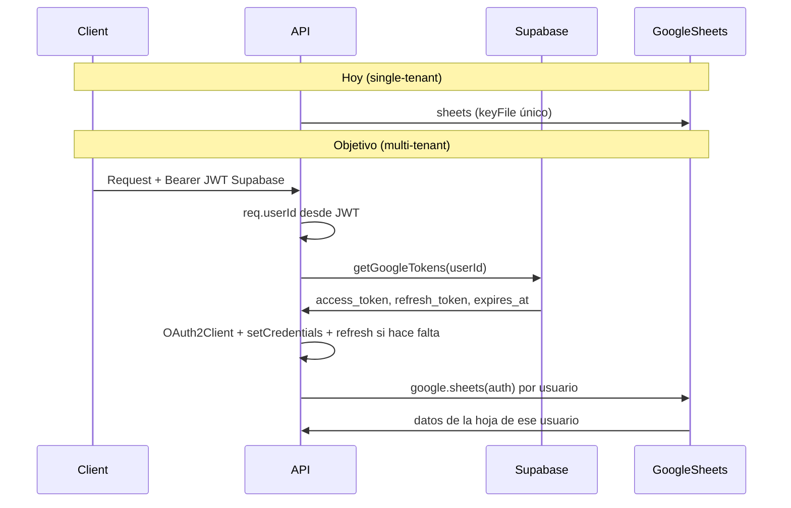

# Autenticación Google Sheets multi-tenant (paso a paso)

Tu [src/config/googleSheets.js](src/config/googleSheets.js) hoy usa **una sola credencial** (service account con `keyFile`). Para multi-tenant necesitas un **cliente de Sheets por usuario**, construido con los tokens OAuth que ya guardas en `user_google_tokens` tras el flujo de [src/routes/authRoutes.js](src/routes/authRoutes.js) y [oauth2.js](src/config/oauth2.js).

---

## Resumen del flujo actual vs el que quieres

---

## Paso 1: Completar el servicio de tokens en Supabase

**Archivo:** [src/services/supabaseTokenService.js](src/services/supabaseTokenService.js)

Ya tienes `saveGoogleTokens`. Falta:

1. **Función `getGoogleTokensByUserId(userId)**`
  - Consultar la tabla `user_google_tokens` donde `user_id = userId`.
  - Devolver `{ access_token, refresh_token, expires_at }` (y si usas `spreadsheet_id` por usuario, incluirlo también).
  - Si no hay fila, devolver `null`.
2. **Refresco de tokens**
  - Si `expires_at` ya pasó (o está a menos de ~5 minutos), usar el cliente OAuth2 de [oauth2.js](src/config/oauth2.js) con `setCredentials({ refresh_token })` y llamar a `oauth2Client.refreshAccessToken()`.
  - Con los nuevos tokens, hacer **upsert** en `user_google_tokens` (igual que en `saveGoogleTokens`) y devolver los tokens actualizados.
  - Así siempre que el sheet service pida tokens, podrás devolver un `access_token` válido.

Opcional: si en tu tabla no está la columna `spreadsheet_id`, puedes añadirla en Supabase y usarla después en el sheet service para que cada usuario tenga su propia hoja (o seguir usando `SPREADSHEET_ID` de `.env` para todos).

---

## Paso 2: Dejar de usar el cliente único en `googleSheets.js`

**Archivo:** [src/config/googleSheets.js](src/config/googleSheets.js)

- **Quitar** la creación del cliente con `keyFile` y la exportación de una instancia fija `sheets` y `auth`.
- **Añadir** una función que reciba `userId` y devuelva un cliente de Sheets autenticado con OAuth para ese usuario, por ejemplo:
  - `getSheetsClientForUser(userId)` (o `getSheetsForUser(userId)`).

**Lógica de `getSheetsClientForUser(userId)`:**

1. Llamar a `getGoogleTokensByUserId(userId)` del paso 1 (incluyendo la lógica de refresco que hayas puesto ahí o en un helper).
2. Si no hay tokens → lanzar un error claro (ej. `new Error('Usuario sin tokens de Google')`).
3. Crear un cliente OAuth2 con `createOAuth2Client()` de [oauth2.js](src/config/oauth2.js).
4. Hacer `oauth2Client.setCredentials({ access_token, refresh_token, expiry_date })`. Si guardas `expires_at` en ISO, conviértelo a milisegundos para `expiry_date` si la librería lo pide.
5. (Opcional) Registrar `oauth2Client.on('tokens', (tokens) => { ... })` para, cuando se refresque el token, volver a guardar en `user_google_tokens` con `saveGoogleTokens` o una función de “update tokens” que solo actualice access_token y expires_at.
6. Devolver `google.sheets({ version: 'v4', auth: oauth2Client })`.

Así, **no exportas** un `sheets` global; solo exportas la función que, dado un `userId`, devuelve el cliente de Sheets de ese usuario.

---

## Paso 3: Identificar al usuario en cada request (middleware)

Las rutas de transacciones hoy no saben “quién” es el usuario. Necesitas que cada petición lleve el JWT de Supabase y que el backend extraiga el `user_id`.

1. **Middleware de auth** (ej. `src/middleware/checkAuth.js`):
  - Leer el header `Authorization: Bearer <token>`.
  - Si no hay token → responder 401.
  - Verificar el JWT con el secret de Supabase (por ejemplo `jwt.verify(token, process.env.SUPABASE_JWT_SECRET)`). Supabase pone el ID del usuario en `decoded.sub`.
  - Asignar `req.userId = decoded.sub` (o `req.user.id`) para usarlo en controladores.
  - Si el token es inválido o expirado → 401.
2. **Aplicar el middleware** en [src/routes/transactionRoutes.js](src/routes/transactionRoutes.js) a todas las rutas (GET/POST/PUT/DELETE de transacciones).
3. Asegurar que en `.env` tengas `SUPABASE_JWT_SECRET` (desde Supabase: Project Settings → API → JWT Secret). Si usas `jsonwebtoken`, añadir la dependencia en `package.json`.

---

## Paso 4: Sheet service por usuario

**Archivo:** [src/services/sheetService.js](src/services/sheetService.js)

- Dejar de importar el `sheets` fijo de [googleSheets.js](src/config/googleSheets.js).
- En cada función (`getAllTransactions`, `createTransaction`, `updateTransaction`, `deleteTransaction`), recibir como primer argumento el `userId`.
- Al inicio de cada función:
  1. Llamar a `getSheetsClientForUser(userId)` para obtener el cliente de Sheets de ese usuario.
  2. Si no hay tokens (error del paso 2) → propagar un error claro (ej. “Conecta tu cuenta de Google”).
  3. Usar ese cliente para todas las llamadas a `spreadsheets.values.get`, `append`, `update`, `batchUpdate`, etc., en lugar del `sheets` global.
- El `spreadsheetId` puede venir de:
  - La tabla `user_google_tokens` (campo `spreadsheet_id`) si ya lo tienes por usuario, o
  - `process.env.SPREADSHEET_ID` si por ahora todos usan la misma hoja.

---

## Paso 5: Controller: pasar `userId` al sheet service

**Archivo:** [src/controllers/transactionController.js](src/controllers/transactionController.js)

- En cada acción (getTransactions, createTransaction, updateTransaction, deleteTransaction), leer `req.userId` (o el que hayas puesto en el middleware).
- Llamar al sheet service pasando ese `userId` como primer argumento, por ejemplo:
  - `sheetService.getAllTransactions(req.userId)`
  - `sheetService.createTransaction(req.userId, req.body)`
  - `sheetService.updateTransaction(req.userId, IdOriginal, req.body)`
  - `sheetService.deleteTransaction(req.userId, IdOriginal)`

Así cada usuario solo verá/modificará datos con su propia cuenta de Google (y, si lo implementas, su propia hoja).

---

## Paso 6: Ajustes opcionales

- **authStatus** ([src/controllers/authController.js](src/controllers/authController.js)): Hoy usa `loadTokens()` de archivo. Si quieres que “estado” sea por usuario, esa ruta puede requerir Bearer y devolver si ese `userId` tiene tokens en `user_google_tokens` (y opcionalmente su `spreadsheet_id`).
- **Spreadsheet por usuario**: Si añadiste `spreadsheet_id` en `user_google_tokens`, una ruta protegida tipo `PUT /api/users/me/spreadsheet` con body `{ "spreadsheet_id": "..." }` puede llamar a un método en `supabaseTokenService` para actualizar ese campo; el sheet service entonces usará siempre el `spreadsheet_id` del usuario.

---

## Orden sugerido para que lo apliques tú

1. **Paso 1** – Implementar `getGoogleTokensByUserId` (y refresco) en `supabaseTokenService.js`.
2. **Paso 2** – Refactorizar `googleSheets.js` a una función `getSheetsClientForUser(userId)` que use OAuth con tokens de Supabase.
3. **Paso 3** – Crear middleware de auth y proteger rutas de transacciones.
4. **Paso 4** – Modificar `sheetService.js` para recibir `userId` y usar el cliente devuelto por `getSheetsClientForUser(userId)`.
5. **Paso 5** – En el controller, pasar `req.userId` a todas las llamadas del sheet service.

Con esto tendrás autenticación multi-tenant para Google Sheets usando la tabla `user_google_tokens` y el mismo flujo de auth que ya usas en `authRoutes.js`.