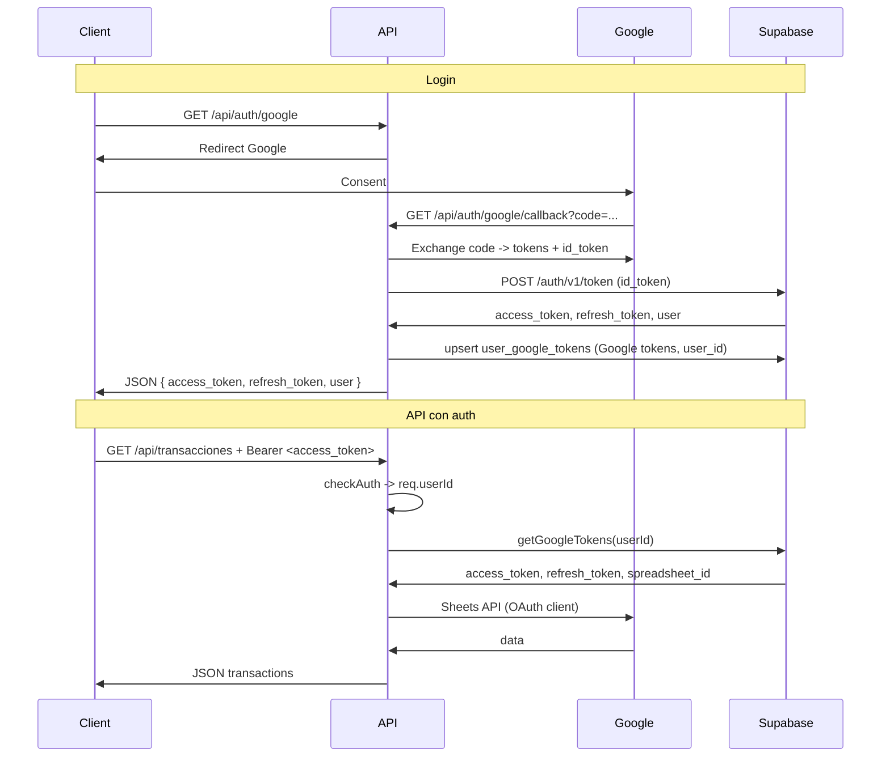

# Plan: Supabase para sesiones, almacenamiento de tokens y protección de rutas

## 1. Supabase: configuración y tabla de tokens

- **Proyecto Supabase**: Crear proyecto (o usar existente). Anotar:
  - `SUPABASE_URL`
  - `SUPABASE_SERVICE_ROLE_KEY` (solo backend; para acceder a DB sin RLS)
  - **JWT Secret** (Project Settings → API → JWT Secret) → `SUPABASE_JWT_SECRET` para verificar tokens.
- **Tabla `user_google_tokens**` (SQL en Supabase):

```sql
create table user_google_tokens (
  user_id uuid primary key references auth.users(id) on delete cascade,
  access_token text not null,
  refresh_token text,
  expires_at timestamptz,
  spreadsheet_id text,
  updated_at timestamptz default now()
);

-- Índice por user_id ya implícito en PK. RLS: acceso solo vía service role en backend.
```

- **Variables de entorno** (añadir a [.env.example](.env.example) y `.env`):

```
SUPABASE_URL=https://xxx.supabase.co
SUPABASE_SERVICE_ROLE_KEY=eyJ...
SUPABASE_JWT_SECRET=your-jwt-secret-from-project-settings
```

---

## 2. Dependencia para JWT

- Añadir `jsonwebtoken` para verificar el access_token de Supabase en el middleware.

---

## 3. Flujo OAuth actual → sesión Supabase + guardar tokens

- Mantener **nuestro** flujo OAuth con Google ([src/config/oauth2.js](src/config/oauth2.js), [src/controllers/authController.js](src/controllers/authController.js)).
- Añadir scope `openid` en [oauth2.js](src/config/oauth2.js) para obtener `id_token` de Google.
- En el **callback** (`handleCallback`):
  1. Intercambiar `code` por tokens de Google (incl. `id_token`).
  2. Llamar a Supabase Auth API: `POST /auth/v1/token` con `grant_type=id_token`, `provider=google`, `id_token=...`. Supabase crea/vincula usuario y devuelve `access_token` y `refresh_token` de Supabase.
  3. Hacer upsert en `user_google_tokens`: `user_id` = `user.id` de la respuesta, `access_token` y `refresh_token` de **Google** (no los de Supabase), `expires_at` si viene en la respuesta de Google. `spreadsheet_id` puede quedar `null` hasta que el usuario lo configure.
  4. Responder **JSON** con la sesión Supabase, por ejemplo:
    ```json
     {
       "access_token": "<supabase access_token>",
       "refresh_token": "<supabase refresh_token>",
       "expires_in": 3600,
       "user": { "id": "...", "email": "..." }
     }
    ```
- Dejar de usar `tokens.json`: eliminar `saveTokens`/`loadTokens` a archivo y toda escritura/lectura de `tokens.json`.

---

## 4. Servicio Supabase para tokens (backend)

- Nuevo módulo, por ejemplo `src/services/supabaseTokenService.js`:
  - Cliente Supabase con `SUPABASE_SERVICE_ROLE_KEY` (solo backend).
  - `upsertGoogleTokens(userId, { access_token, refresh_token, expires_at })`.
  - `getGoogleTokens(userId)` → `{ access_token, refresh_token, spreadsheet_id }` o `null`.
  - `setSpreadsheetId(userId, spreadsheetId)` para cuando el usuario configure su hoja.
- Este servicio se usará en el callback (upsert) y en el sheet service (lectura por `userId`).

---

## 5. Middleware de autenticación

- Nuevo `src/middleware/checkAuth.js`:
  - Extraer `Authorization: Bearer <token>`.
  - Si no hay token → `401` con mensaje tipo "No autorizado".
  - Verificar con `jwt.verify(token, process.env.SUPABASE_JWT_SECRET)`.
  - Asignar `req.userId = decoded.sub` (Supabase usa `sub` como user id).
  - En caso de error de verificación → `401` "Token inválido".
- Estructura similar a tu ejemplo, pero usando `SUPABASE_JWT_SECRET` y `decoded.sub`.

---

## 6. Protección de rutas

- Aplicar `checkAuth` a todas las rutas en [transactionRoutes.js](src/routes/transactionRoutes.js).
- Dejar **sin** middleware: `/api/auth/google`, `/api/auth/google/callback`, `/api/auth/error`. Opcionalmente `/api/auth/status` puede requerir auth (si quieres que devuelva solo el usuario de la sesión actual).

---

## 7. Refactor del sheet service y config de Sheets

- **Eliminar** uso de [googleSheets.js](src/config/googleSheets.js) (service account) para el flujo de transacciones vía API.
- **Refactor de** [sheetService.js](src/services/sheetService.js):
  - Las funciones reciben `userId` (desde el controller vía `req.userId`).
  - Para cada request:
    1. Obtener tokens y `spreadsheet_id` con `supabaseTokenService.getGoogleTokens(userId)`.
    2. Si no hay tokens → error claro (ej. 401 o 403 con mensaje "Conecta tu cuenta de Google").
    3. Si `spreadsheet_id` es `null` → error claro (ej. 409 o 400: "Configura tu hoja de cálculo").
    4. Crear `OAuth2Client` desde [oauth2.js](src/config/oauth2.js), `setCredentials` con los tokens de Google, y usar `google.sheets({ version: 'v4', auth })` para esa request.
- Mantener `SHEET_NAME` y `RANGE` como hasta ahora; solo cambiar el origen de `spreadsheet_id` (por usuario) y de `auth` (OAuth por usuario).
- **Controller** [transactionController.js](src/controllers/transactionController.js): pasar `req.userId` a todas las llamadas del sheet service.

---

## 8. Configuración de `spreadsheet_id` por usuario

- Nueva ruta protegida, por ejemplo `PUT /api/users/me/spreadsheet` con body `{ "spreadsheet_id": "..." }`.
- Middleware `checkAuth` ya aplicado.
- Implementación: `supabaseTokenService.setSpreadsheetId(req.userId, spreadsheetId)` y responder 200.
- Opcional: `GET /api/users/me` (protegida) que devuelva `user` desde Supabase y, si existe, `spreadsheet_id` desde `user_google_tokens`.

---

## 9. Ajustes en auth y limpieza

- `**/api/auth/success**`: Ya no redirigir aquí tras el callback; el callback devuelve JSON. Puedes eliminar la ruta o dejarla como redirección legacy y usar el nuevo flujo JSON por defecto.
- `**/api/auth/status**`: Si se mantiene sin auth, devolver solo si hay sesión vía cookie o similar; como entregamos sesión por JSON y el cliente manda Bearer, suele tener más sentido un `GET /api/users/me` protegido que use el token. Opcional: eliminar `authStatus` o adaptarlo.
- Eliminar dependencia de `tokens.json` y referencias a `TOKENS_PATH` en [oauth2.js](src/config/oauth2.js). Opcional: borrar `tokens.json` del repo y asegurar que sigue en `.gitignore`.

---

## 10. Diagrama de flujo (resumido)




---

## 11. Resumen de cambios por archivo


| Archivo                                                                              | Cambios                                                                                                                                                               |
| ------------------------------------------------------------------------------------ | --------------------------------------------------------------------------------------------------------------------------------------------------------------------- |
| [package.json](package.json)                                                         | Añadir `jsonwebtoken`                                                                                                                                                 |
| [.env.example](.env.example)                                                         | `SUPABASE_URL`, `SUPABASE_SERVICE_ROLE_KEY`, `SUPABASE_JWT_SECRET`                                                                                                    |
| [src/config/oauth2.js](src/config/oauth2.js)                                         | Añadir `openid` scope; quitar persistencia en `tokens.json`; exponer `createOAuth2Client` y helpers para usar tokens en memoria                                       |
| [src/controllers/authController.js](src/controllers/authController.js)               | Callback: id_token → Supabase Auth, upsert en `user_google_tokens`, responder JSON con sesión Supabase; ajustar/eliminar `authSuccess` y `authStatus` según se decida |
| [src/routes/authRoutes.js](src/routes/authRoutes.js)                                 | Mantener `/google` y `/google/callback`; adaptar resto si se eliminan success/status                                                                                  |
| [src/app.js](src/app.js)                                                             | Montar rutas de `users` si se añaden                                                                                                                                  |
| **Nuevo** `src/services/supabaseTokenService.js`                                     | Cliente Supabase (service role), upsert/get tokens, `setSpreadsheetId`                                                                                                |
| **Nuevo** `src/middleware/checkAuth.js`                                              | Verificar Bearer con JWT secret de Supabase, `req.userId = decoded.sub`                                                                                               |
| [src/routes/transactionRoutes.js](src/routes/transactionRoutes.js)                   | Aplicar `checkAuth` a todas las rutas                                                                                                                                 |
| [src/controllers/transactionController.js](src/controllers/transactionController.js) | Pasar `req.userId` al sheet service                                                                                                                                   |
| [src/services/sheetService.js](src/services/sheetService.js)                         | Recibir `userId`; obtener tokens y `spreadsheet_id` desde Supabase; usar OAuth por request; eliminar uso de `googleSheets` (service account)                          |
| [src/config/googleSheets.js](src/config/googleSheets.js)                             | Dejar de usar en flujo transacciones (opcional eliminarlo si no se usa en ningún otro sitio)                                                                          |


---

## 12. Orden de implementación sugerido

1. Crear tabla `user_google_tokens` en Supabase y configurar env.
2. Implementar `supabaseTokenService` y `checkAuth`.
3. Adaptar OAuth (scopes, callback) para Supabase Auth y guardar tokens en `user_google_tokens`; respuesta JSON.
4. Proteger rutas de transacciones con `checkAuth` y refactorizar sheet service + controller a OAuth por usuario y `spreadsheet_id` por usuario.
5. Añadir `PUT /api/users/me/spreadsheet` (y opcionalmente `GET /api/users/me`).
6. Limpiar `tokens.json`, `authSuccess`/`authStatus` y referencias a servicio por archivo.

